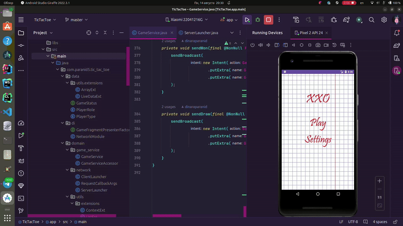

**XXO**
-----------------

## **Developer**
[Paranid5](https://github.com/dinaraparanid)

## **About App**
**XXO** is a Tic-Tac-Toe Android game, featuring multiplayer gameplayer. Game supports sessions for two players: first as the host that launches server on his device; second as the client that connects to the game. Stable WiFi connection is required to play game

### **Preview**

  
  <>
   

### **Stack**

<ul>
    <li>Java 7 (for compatibility of an older API)</li>
    <li>MVVM + Data Binding</li>
    <li>Dagger Hilt + Assisted Inject</li>
    <li>RxJava3</li>
    <li>Work Manager + RxWorker</li>
    <li>Java NIO (server)</li>
    <li>Java Net (client)</li>
    <li>Jetpack ViewModel</li>
    <li>Jetpack Constraint Layout</li>
    <li>Bounded Service + Broadcast Receivers</li>
    <li>Android Material Design views</li>
    <li>Carbon UI library</li>
</ul>

## **Current Status:**

**Alpha V 0.1.0.0**

### **Implemented features:**
1. Game session for two players: create new room or join to
2. Game rules, winning, loosing, draw
3. Game restarts, player left session handling

### **TODO:**
1. Singleplayer
2. Session protection
3. Settings

## **System Requirements**
**Android 5.0** or higher

**Stable WiFfi connection** to create or join the game session is required

## **License**
*GNU Public License V 3.0*
